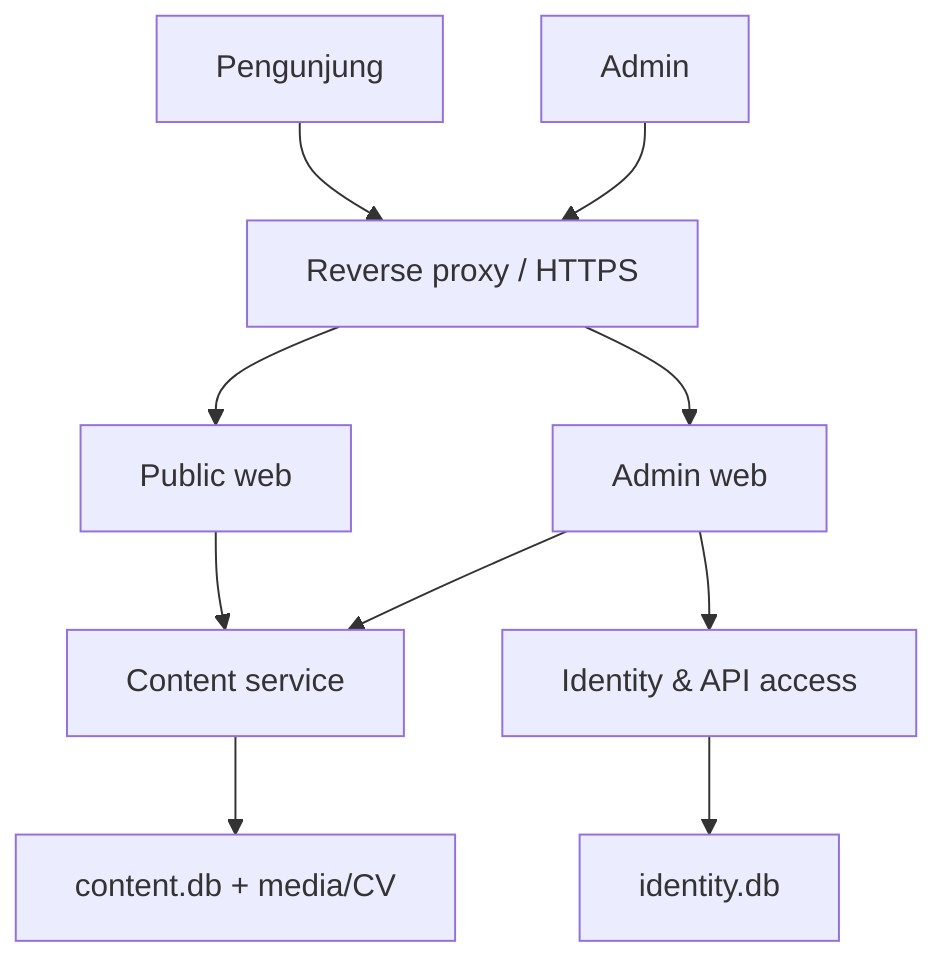
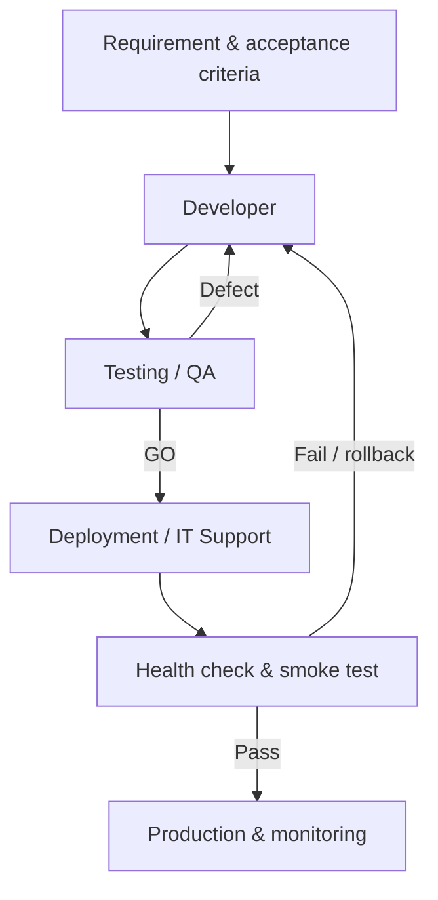

# Blueprint Agen dan Arsitektur Website Portofolio Flask

Status: perencanaan, belum berisi implementasi aplikasi.

## 1. Interpretasi kebutuhan

Website menampilkan portofolio publik yang dapat dikelola melalui area admin. Menu minimum:

1. Home
2. Projects
3. CV
4. Blog
5. Pengaturan bahasa

Saya menganggap kata “block” berarti “blog”. Pengaturan bahasa sebaiknya berupa selector di header, bukan halaman utama tersendiri, tetapi route seperti `/settings/language` tetap dapat disediakan bila dibutuhkan.

Konten yang dikelola admin:

| Area | Data yang dapat diperbarui |
| --- | --- |
| Home | Hero, foto, perkenalan, skill ringkas, CTA, urutan section |
| Projects | Judul, slug, ringkasan, penjelasan, teknologi, gambar, link demo/repository, status publish, urutan |
| Blog | Judul, slug, excerpt, isi, cover, tag, status draft/publish, tanggal publish |
| CV | File PDF aktif, label, bahasa, versi, tanggal update |
| Menu | Label per bahasa, URL, urutan, visibility |
| Bahasa | Indonesia, Inggris, Jepang, dan fallback |
| API | API key, scope, status aktif, expiry, revoke, audit penggunaan |

## 2. Keputusan arsitektur utama

Rekomendasi paling sehat untuk tahap awal adalah **microfrontend secara batas produk, microservice-ready secara backend**. Alasannya:

- Public dan Admin memang memiliki pengguna, risiko keamanan, asset, serta pola rilis yang berbeda sehingga layak dipisahkan.
- Portofolio pribadi belum membutuhkan banyak service operasional.
- SQLite menggunakan locking pada file saat penulisan; membiarkan banyak service menulis database yang sama meningkatkan risiko `database is locked`.

Karena tujuan Anda juga mempelajari microfrontend dan microservice, target akhir tetap memisahkan dua frontend dan dua backend service, tetapi dilakukan bertahap.

### Tahap MVP yang disarankan

- Satu deployment Flask dengan `app.py` sebagai entry point.
- Application factory `create_app()`.
- Blueprint terpisah untuk public, admin, public API, dan admin API.
- Package domain terpisah untuk content dan identity/access.
- Satu SQLite database pada instance folder.
- Public dan Admin memiliki template, JavaScript, serta CSS sendiri; hanya shared UI yang dipakai bersama.

Ini mengikuti pola resmi Flask: application factory memudahkan konfigurasi dan testing, sedangkan Blueprints memecah aplikasi besar menjadi komponen. Flask-SQLAlchemy juga mendukung pola extension dibuat tanpa langsung terikat ke app, lalu dihubungkan melalui `init_app()`.

### Target pemisahan setelah MVP stabil

- `public-web`: halaman publik.
- `admin-web`: CMS/admin UI.
- `content-service`: konten, terjemahan, media, CV, publish flow.
- `identity-access-service`: admin user, login/session atau token, API key dan scope.
- Setiap service memiliki database sendiri; tidak ada shared database write.

## 3. Gambaran arsitektur target



Aturan penting: hanya `content-service` yang menulis `content.db`, dan hanya `identity-access-service` yang menulis `identity.db`. Token dari identity diverifikasi content service untuk operasi admin.

## 4. Batas tanggung jawab aplikasi

| Komponen | Tanggung jawab | Tidak boleh menangani |
| --- | --- | --- |
| Public web | Render Home, Projects, Blog, CV, bahasa, SEO, cache publik | Login admin dan mutation content |
| Admin web | Form CMS, preview, publish, upload, menu, API management UI | Menulis database secara langsung |
| Content service | Content CRUD, draft/publish, terjemahan, media, CV, public read API | Password dan penerbitan API key |
| Identity & API access | Admin user, session/token, role, API key, scope, revoke | Isi project/blog/home |
| Shared UI | Design tokens, layout primitives, utilities, API helper, Web Components terpilih | State atau business rule halaman tertentu |

## 5. Model microfrontend

Microfrontend tidak harus memakai React atau Module Federation. Dengan vanilla JavaScript, bentuk yang cocok adalah:

- Public dan Admin sebagai dua aplikasi dengan lifecycle dan asset bundle berbeda.
- Shared CSS berupa design tokens, utility classes, dan layout primitives.
- Shared JavaScript berupa API client, DOM helpers, validation helpers, formatter, dan i18n helper.
- Native Web Components hanya untuk komponen lintas aplikasi yang interaktif, misalnya language selector, toast, modal konfirmasi, dan image uploader.
- Jinja partial/macro digunakan untuk reuse dalam satu aplikasi; jangan menjadikannya coupling langsung antar-deployment.

## 6. Struktur folder yang direkomendasikan untuk MVP

```text
portfolio/
├── app.py                         # entry point tipis
├── pyproject.toml
├── .env.example
├── migrations/
├── instance/                      # SQLite lokal; tidak masuk Git
├── storage/                       # upload media/CV; tidak masuk Git
├── portfolio/
│   ├── __init__.py                # create_app()
│   ├── config.py
│   ├── extensions.py              # db, migration, login, csrf
│   ├── public_web/
│   │   ├── routes.py
│   │   ├── templates/public/
│   │   └── static/public/
│   │       ├── css/
│   │       └── js/
│   │           ├── pages/
│   │           └── components/
│   ├── admin_web/
│   │   ├── routes.py
│   │   ├── templates/admin/
│   │   └── static/admin/
│   │       ├── css/
│   │       └── js/
│   │           ├── pages/
│   │           └── components/
│   ├── api/
│   │   ├── public/
│   │   └── admin/
│   ├── domains/
│   │   ├── content/
│   │   │   ├── models.py
│   │   │   ├── repositories.py
│   │   │   ├── services.py
│   │   │   └── policies.py
│   │   └── identity_access/
│   │       ├── models.py
│   │       ├── repositories.py
│   │       ├── services.py
│   │       └── policies.py
│   └── shared/
│       ├── templates/
│       ├── static/
│       │   ├── css/
│       │   └── js/
│       ├── validators.py
│       ├── exceptions.py
│       └── utils.py
└── tests/
    ├── unit/
    ├── integration/
    ├── e2e/
    └── fixtures/
```

`app.py` hanya memanggil application factory. Business logic tidak ditempatkan di `app.py`, route, template, atau JavaScript page.

Jika nanti benar-benar dipecah, setiap deployable memperoleh folder dan `app.py` sendiri. Monorepo dapat tetap dipakai, tetapi database, konfigurasi, migration, test, dan release unit harus dimiliki masing-masing service.

## 7. Entitas data konseptual

### Content domain

| Entitas | Tujuan utama |
| --- | --- |
| `SitePage` | Identitas halaman seperti Home |
| `SitePageTranslation` | Isi halaman per bahasa |
| `Project` | Metadata non-terjemahan, slug, status, urutan |
| `ProjectTranslation` | Judul, ringkasan, isi per bahasa |
| `BlogPost` | Slug, draft/publish, author reference, timestamp |
| `BlogPostTranslation` | Judul, excerpt, isi per bahasa |
| `NavigationItem` | URL, posisi, urutan, visibility |
| `NavigationTranslation` | Label menu per bahasa |
| `MediaAsset` | Lokasi file, MIME, ukuran, alt text, owner reference |
| `CVDocument` | File PDF, bahasa, versi, status current |
| `ContentAuditEvent` | Actor ID, aksi, target, waktu, perubahan ringkas |

### Identity/access domain

| Entitas | Tujuan utama |
| --- | --- |
| `AdminUser` | Account admin dan status aktif |
| `Role` / `Permission` | Pemisahan Owner dan Editor |
| `ApiCredential` | Hash API key, prefix, expiry, revoke status |
| `ApiScope` | `content:read`, `content:write`, `media:write`, `api:manage` |
| `SecurityAuditEvent` | Login, gagal login, create/revoke key, perubahan role |

Password dan API key tidak pernah disimpan dalam bentuk plaintext. Nilai rahasia hanya ditampilkan satu kali ketika dibuat.

## 8. Route dan API konseptual

### Public pages

- `GET /`
- `GET /projects`
- `GET /projects/<slug>`
- `GET /blog`
- `GET /blog/<slug>`
- `GET /cv`
- `GET /cv/download`
- `POST /settings/language`

### Admin pages

- `/admin/login`
- `/admin/dashboard`
- `/admin/home`
- `/admin/projects`
- `/admin/blog`
- `/admin/navigation`
- `/admin/media`
- `/admin/cv`
- `/admin/api-keys`
- `/admin/audit`

### API groups

- `/api/v1/public/*`: hanya data published, read-only.
- `/api/v1/admin/content/*`: authenticated mutation.
- `/api/v1/admin/media/*`: authenticated upload/delete.
- `/api/v1/admin/api-keys/*`: hanya Owner atau scope `api:manage`.
- `/health/live` dan `/health/ready`: operasional, tanpa membocorkan detail rahasia.

Semua write endpoint harus memiliki validasi, authorization, consistent error shape, audit event, dan proteksi replay/idempotency jika operasinya dapat diulang oleh client.

## 9. Strategi bahasa

- Bahasa awal: Indonesia (`id`), Inggris (`en`), Jepang (`ja`).
- Prioritas pilihan: URL/query yang eksplisit, cookie user, header browser, lalu default `id`.
- Slug dapat tetap satu nilai stabil lintas bahasa agar link tidak mudah rusak.
- Jika terjemahan belum tersedia, fallback ke bahasa default dan beri tanda di admin.
- Public tidak menampilkan draft translation.
- SEO menggunakan title, description, canonical URL, dan `hreflang` yang konsisten.

## 10. Keamanan minimum

- Admin login dengan password hash kuat dan secure session cookie.
- Role minimum: `Owner` dan `Editor`; hanya Owner mengelola user dan API key.
- CSRF protection untuk form/session-based mutation.
- Rate limit login dan API sensitif.
- Validasi upload menggunakan MIME sebenarnya, ekstensi allowlist, ukuran maksimum, nama file acak, dan lokasi di luar source tree.
- CV hanya PDF; gambar hanya format yang disetujui dan diproses ulang bila perlu.
- Escape output; rich text harus disanitasi sebelum disimpan atau dirender.
- Jangan mengekspos draft, stack trace, secret, database, upload asli, atau backup.
- Security headers, HTTPS, audit log, backup terenkripsi sesuai kebutuhan, dan dependency update terjadwal.

## 11. Definisi tiga agen

| Agen | Fokus | Skill utama | Output wajib | Batas |
| --- | --- | --- | --- | --- |
| Developer | Requirement, arsitektur, data/API contract, implementasi, migration | Flask, Python 3.12, SQLAlchemy, SQLite, vanilla JS, HTML/CSS, Jinja, auth, i18n, API design | Backlog, ADR, acceptance criteria, change summary, QA handoff | Tidak memberi release sign-off atau deploy production |
| Testing/QA | Verifikasi functional/non-functional, security, accessibility, regression | pytest, Flask test client, API/UI testing, OWASP, upload testing, WCAG, performance baseline | Test plan, evidence, defect report, GO/NO-GO | Tidak memperbaiki produk secara diam-diam |
| Deployment/IT Support | Environment, release, backup, monitoring, rollback, incident | Linux, WSGI, reverse proxy, HTTPS, secrets, SQLite operations, logs, restore, troubleshooting | Runbook, checklist, smoke evidence, rollback, incident record | Tidak mengubah production/DNS/credential tanpa izin eksplisit |

Skill Codex yang disiapkan:

- `$plan-portfolio-flask-development`
- `$verify-portfolio-flask-quality`
- `$operate-portfolio-flask-deployment`

## 12. Flow kerja antaragen



### Handoff Developer → QA

- Requirement dan acceptance criteria final.
- Build/change identifier.
- Daftar perubahan file atau komponen.
- Migration/seed requirement.
- Test account dan fixture non-production.
- Risiko, area regresi, dan known limitations.

### Handoff QA → Deployment

- Build yang diverifikasi.
- Test summary dan release recommendation.
- Open defects dan accepted risks.
- Smoke-test checklist.
- Konfigurasi/migration expectation.
- Rollback trigger.

### Handoff Deployment → Support

- Release record.
- Health dan smoke-test evidence.
- Backup identifier dan restore instruction.
- Monitoring dashboard/checklist.
- Known issues dan escalation owner.

## 13. Tahapan proyek

| Fase | Hasil |
| --- | --- |
| 0. Discovery | Tujuan portfolio, target audience, bahasa, content inventory, domain/hosting, acceptance criteria |
| 1. Architecture | Boundary, folder map, data model, API contract, auth model, ADR SQLite dan split strategy |
| 2. Foundation | Application factory, config, extension, database migration, shared UI, error handling |
| 3. Public experience | Home, Projects, Blog, CV, bahasa, responsive UI, SEO |
| 4. Admin CMS | Auth, dashboard, content CRUD, draft/publish, menu, media, CV, API key |
| 5. Quality | Unit/integration/E2E, security, accessibility, browser, performance, recovery test |
| 6. Release | Staging, backup, migration, deployment, smoke, monitoring, rollback readiness |
| 7. Extraction opsional | Pisahkan public/admin deployment dan service hanya jika kebutuhan operasional membenarkan |

## 14. Definition of Done

Sebuah feature selesai hanya jika:

- acceptance criteria terpenuhi;
- authorization dan validation telah ditentukan;
- unit/integration test yang relevan lulus;
- critical journey dan regression test lulus;
- bahasa default serta fallback bekerja;
- keyboard dan responsive behavior diperiksa;
- upload dan error path aman;
- migration dan rollback impact terdokumentasi;
- logging tidak membocorkan secret;
- dokumentasi handoff tersedia.

Release selesai hanya jika QA memberi GO atau risk acceptance tercatat, backup dapat dipulihkan, migration berhasil, health check dan smoke test lulus, serta rollback tetap tersedia.

## 15. Keputusan yang masih perlu Anda pilih nanti

1. Bahasa yang benar-benar diperlukan saat rilis pertama: `id`, `en`, dan `ja`, atau subset.
2. Hosting target: VPS, platform-as-a-service, atau container hosting.
3. Apakah hanya satu Owner atau ada Editor tambahan.
4. Apakah isi Blog memakai Markdown, rich-text editor, atau plain HTML yang disanitasi.
5. Apakah project memiliki link repository privat yang tidak boleh tampil publik.
6. Batas ukuran gambar dan CV.
7. Kapan target extraction ke microservices dianggap layak: kebutuhan scaling, independent release, atau tujuan belajar.

## Referensi rancangan

- [Flask Application Factories](https://flask.palletsprojects.com/en/stable/patterns/appfactories/)
- [Flask Blueprints](https://flask.palletsprojects.com/en/stable/blueprints/)
- [Flask Application Dispatching](https://flask.palletsprojects.com/en/stable/patterns/appdispatch/)
- [Flask-SQLAlchemy Quick Start](https://flask-sqlalchemy.palletsprojects.com/en/stable/quickstart/)
- [SQLAlchemy SQLite dialect notes](https://docs.sqlalchemy.org/en/21/dialects/sqlite.html)
- [OpenAI Codex custom agents](https://learn.chatgpt.com/docs/agent-configuration/subagents)
- [OpenAI Codex skills](https://learn.chatgpt.com/docs/build-skills)
